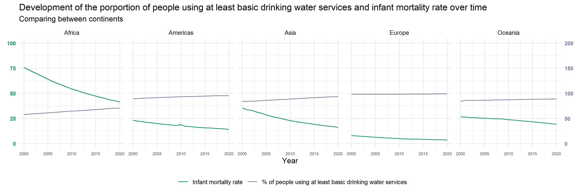
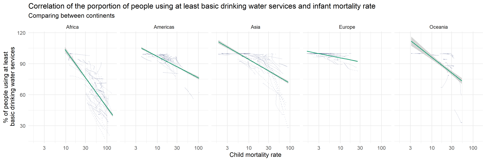
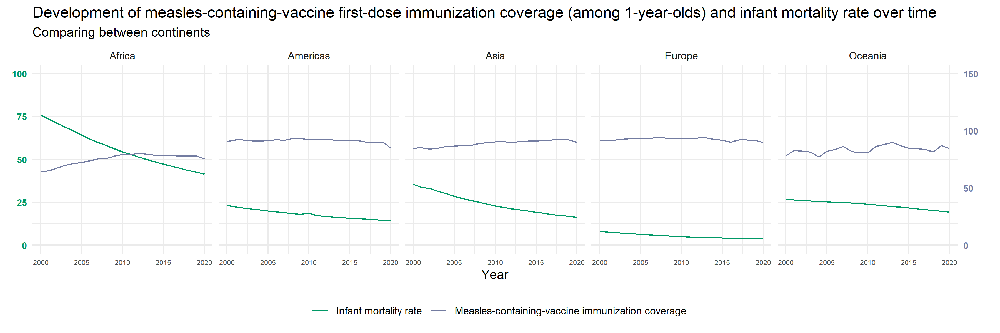
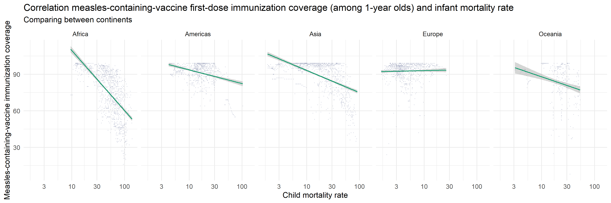
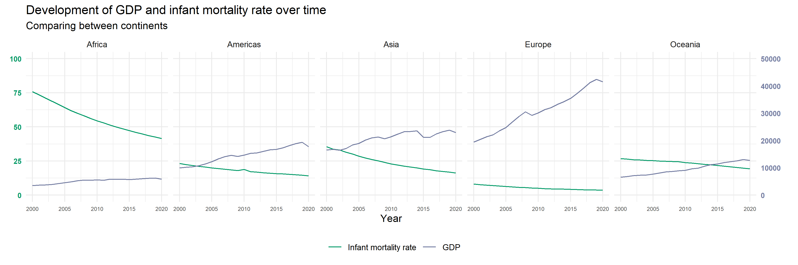

# Part C. APIs


Load all packages here:

```{r warning=FALSE}
library(httr)
library(tidyverse)
library(dplyr)
library(xml2)
library(rvest)
library(jsonlite)
library(gganimate)
library(ggthemes)
library(countrycode)
library(transformr)
library(stringr)
library(Hmisc)
library(corrplot)
```


1. Next, the goal is to obtain country-level development indicators that may be related to linguistic fragmentation from the World Bank API. You can read the documentation and instructions of the API [here](https://datahelpdesk.worldbank.org/knowledgebase/articles/898581-basic-api-call-structures).

Write your own function that will take an indicator code (e.g. `SP.POP.TOTL`) as input, query the API, parse the JSON output into R, and then return a clean data frame where each row is a country. Feel free to take a look at the following [code](https://github.com/vincentarelbundock/WDI/blob/master/R/WDI.R) for some clues on how to query the API. (12 points)

Note: If you are not able to figure this exercise out, you can use the `WDI` package in the next exercises in order to be able to continue with the assignment.

```{r} 
get_indicators <- function(indicatorcode, start, end) {
  
  url_page1 <- paste0("http://api.worldbank.org/v2/country/all/indicator/",
               indicatorcode,
               "?date=",
               start,
               ":",
               end,
               "&format=json&per_page=32500&page=1")
  
  page1_r_format <- GET(url_page1)
  page_1_json_format <- fromJSON(content(page1_r_format, "text"), flatten = T)
  data_all <- data.frame(page_1_json_format)
  
  if (page_1_json_format[[1]]$pages > 1) {
    for (i in 2:page_1_json_format[[1]]$pages) {
      url_page_n = paste0("http://api.worldbank.org/v2/country/all/indicator/",
                         indicatorcode,
                         "?date=",
                         start,
                         ":",
                         end,
                         "&format=json&per_page=32500", 
                         "&page=",
                         i)
      
      page_n_r_format <- GET(url_page_n)
      page_n_json_format <- fromJSON(content(page_n_r_format, "text"), flatten = T)
      data_page_n <- data.frame(page_n_json_format)
      data_all <- rbind(data_all, data_page_n)
    }
  }
  
  data_clean <- data_all[-c(1:7, 11:13)]
  
  return(data_clean)
  
}
example <- get_indicators("EN.ATM.PM25.MC.M3", 2000, 2001)

```


2. Using the function you just created, download country-level data on GDP per capita and other indicators and metrics that could be relevant (see the Alesina et al paper for inspiration). Merge this new country-level dataset with the dataset `part_b_fractionalization_output.csv` that you created at the end of Part B. As before, you may need to fix some of the country names to ensure that all countries can be merged. (4 points)

```{r}
frac <- read.csv("part_b_fractionalization_output.csv")
frac$country_code <- countrycode(frac$country_code, origin = "iso2c", destination = "iso3c")
frac$country_code[frac$country_name == "Kosovo"] <- "XXK"
names(frac)[names(frac) == "country_code"] <- 'countryiso3code'

# GDP: https://data.worldbank.org/indicator/NY.GDP.PCAP.PP.CD
# = initial income because 2020 is at start of decade
gdp <- get_indicators("NY.GDP.PCAP.PP.CD", 1960, 2020)
names(gdp)[3:7] <- paste("gdp.", names(gdp)[3:7], sep="")
frac_full <- merge(frac, gdp, by = "countryiso3code")

# phones per 100 people: https://data.worldbank.org/indicator/IT.CEL.SETS.P2 <- vs phones per 1000 workers
phones <- get_indicators("IT.CEL.SETS.P2", 1960, 2020)
names(phones)[3:7] <- paste("phones.",names(phones)[3:7], sep="")
frac_full <- merge(frac_full, phones, by = c("countryiso3code", "date"))

# gdp growth: https://data.worldbank.org/indicator/NY.GDP.PCAP.KD.ZG
gdp_growth <- get_indicators("NY.GDP.PCAP.KD.ZG", 1960, 2020)
names(gdp_growth)[3:7] <- paste("gdp_growth.",names(gdp_growth)[3:7], sep="")
frac_full <- merge(frac_full, gdp_growth, by = c("countryiso3code", "date"))

# schooling: beginning of each decade, log of 1 + https://data.worldbank.org/indicator/SE.SEC.DURS
schooling <- get_indicators("SE.SEC.DURS", 1960, 2020)
names(schooling)[3:7] <- paste("schooling.",names(schooling)[3:7], sep="")
frac_full <- merge(frac_full, schooling, by = c("countryiso3code", "date"))

```


For the remaining exercises use any summary figures, visualization, statistical analyses, etc. that you find helpful to answer the questions. More extensive, insightful, polished, and well described answers will receive higher marks. Also see the assessment criteria on the course website https://lse-my472.github.io/


3. Using the language fractionalization index from the Alesina et al. paper and data downloaded from the World Bank API, can you roughly replicate some of the findings from the paper? For example, Tables 5 and 8 or other findings? (11 points)

```{r}
# create dummy variables
frac_full$dummy_1960 <- ifelse(frac_full$date %in% str_subset(frac_full$date, "^196\\d{1}"), 1, 0)
frac_full$dummy_1970 <- ifelse(frac_full$date %in% str_subset(frac_full$date, "^197\\d{1}"), 1, 0)
frac_full$dummy_1980 <- ifelse(frac_full$date %in% str_subset(frac_full$date, "^198\\d{1}"), 1, 0)
frac_full$dummy_1990 <- ifelse(frac_full$date %in% str_subset(frac_full$date, "^199\\d{1}"), 1, 0)

latam <- c("AIA","ATG","ARG","ABW","BHS","BRB","BLZ","BOL","BVT","BRA","CYM","CHL","COL","CRI","CUB","CUW","DMA","DOM","ECU","SLV","FLK","GUF","GRD","GLP","GTM","GUY","HTI","HND","JAM","MTQ","MEX","MSR","NIC","PAN","PRY","PER","PRI","BLM","KNA","LCA","MAF","VCT","SXM","SGS","SUR","TTO","TCA","URY","VEN","VGB","VIR")
frac_full$dummy_latam <- ifelse(frac_full$countryiso3code %in% latam, 1, 0)

subsahara <- c("AGO","BEN","BWA","IOT","BFA","BDI","CPV","CMR","CAF","TCD","COM","COG","CIV","DJI","GNQ","ERI","SWZ","ETH","ATF","GAB","GMB","GHA","GIN","GNB","KEN","LSO","LBR","MDG","MWI","MLI","MRT","MUS","MYT","MOZ","NAM","NER","NGA","REU","RWA","STP","SEN","SYC","SLE","SOM","ZAF","SSD","TGO","UGA","ZMB","ZWE")
frac_full$dummy_subsahara <- ifelse(frac_full$countryiso3code %in% subsahara, 1, 0)

colnames(frac_full)[which(names(frac_full) == "language_fractionalization_index_alesina_et_al.")] <- "frac_alesina"
colnames(frac_full)[which(names(frac_full) == "language_fractionalization_index_tweets")] <- "frac_tweets"

# change from scientific to decimal notation
options(scipen = 50)

# Table 5 --------------------------------------------------------------------------------------------------
# get correlations
frac_cor <- frac_full %>% select(c(frac_alesina, gdp.value, gdp_growth.value, schooling.value, phones.value)) %>% 
  mutate(gdp_log = log(gdp.value)) %>% 
  mutate(schooling_log = log(1 + schooling.value)) %>%
  mutate(phones_log = log(phones.value)) %>% 
  select(c(frac_alesina, gdp.value, gdp_log, gdp_growth.value, schooling_log, phones_log)) %>% 
  filter(phones_log != -Inf) %>% 
  cor(use = "complete.obs") %>% round(2)

# format to increase legibility
frac_cor[upper.tri(frac_cor)] <- ""
print(data.frame(frac_cor))

# Table 8: Language fractionalisation and long-term growth -------------------------------------------------
frac_full <- frac_full %>% mutate(phones_log = log(phones.value)) %>% 
  filter(phones_log != -Inf)

lm1 <- lm(gdp_growth.value ~ frac_alesina + log(gdp.value) + log(gdp.value)^2 + log(1 + schooling.value) + phones_log + dummy_1960 + dummy_1970 + dummy_1980 + dummy_1990 + dummy_latam + dummy_subsahara, frac_full)
summary(lm1)

```
**Table 5**
*Just like in the Alesina et al. paper, language diversity is negatively correlated with income (gdp_log at the beginning of the decade, i.e. in this case just gpd_log for every year). The sizes are very similar: -0.41 here vs. -0.293 in the paper.*
*Another finding that fits with the paper is the negative correlation between language diversity and phone distribution. However, the correlation here (-0.13) is much smaller than in the paper (-0.248).*

*The remaining correlations show opposite effects from the paper. Language diversity is not correlated (0) with growth here, whereas in Alesina et al., it is negatively correlated (-0.305). The correlation between language diversity and schooling (0) is non-existent here, versus large and negative in the paper (-0.387).*

*When comparing the two, one has to consider that some independent variables that appear in the paper are missing here, and also schooling and income (log of gdp) are not set to the beginning of the decade like in the paper, but rather taken for every year.*

**Table 8**
*We can see some statistically significant effects.*
*Like in Alesina et al, language diversity as well as schooling correlates positively with GDP growth, however the effects here are not significant.*
*All other coefficients show a different direction than in the paper, which might have something to do with the slightly different construction of variables here. Phone distribution also have a positive correlation with GDP growth, like in the paper, however, also not significant here.* 
*In the paper, initial income is weakly positively correlated with GDP growth, whereas here it is negatively correlated. This finding can be interpreted as "richer countries grow less that poorer countries".*

4. Using the language fractionalization Twitter-based index which you built, can you find interesting correlations with indicators from the World Bank or is the Twitter data too noisy? Are correlations stronger when only countries are considered for which at least a certain amount of tweets were contained in the dataset? A starting point could be to repeat some outcome from 3. now with the Twitter-based index.

A word of caution when interpreting these results:  We can form hypotheses based on such findings, but only from the fact that variables co-move/correlate even when controlling for some others variables in a regression, we cannot say whether they cause each other to move or not [link](https://en.wikipedia.org/wiki/Correlation_does_not_imply_causation) (7 points)

```{r}
# use only data from 2020
frac_2020 <- frac_full[frac_full$date == 2020,]
frac_2020 <- frac_2020[is.na(frac_2020$frac_tweets) == FALSE,]
nrow(frac_2020) # Only 42 observations left

# Table 5
# get correlations (all countries)
frac_cor_twitter <- frac_2020 %>% select(c(frac_tweets, gdp.value, gdp_growth.value, schooling.value, phones.value)) %>%
  mutate(gdp_log = log(gdp.value)) %>% 
  mutate(schooling_log = log(1 + schooling.value)) %>%
  mutate(phones_log = log(phones.value)) %>% 
  select(c(frac_tweets, gdp.value, gdp_log, gdp_growth.value, schooling_log, phones_log)) %>% 
  cor(use = "complete.obs") %>% round(2) ## decided to exclude incomplete entries

frac_cor_twitter[upper.tri(frac_cor_twitter)] <- ""
print(data.frame(frac_cor_twitter))

# get correlations (high n of tweets countries)
frac_cor_twitter_high <- frac_2020 %>% filter(tweets_collected > 500) %>% 
  select(c(frac_tweets, gdp.value, gdp_growth.value, schooling.value, phones.value)) %>%
  mutate(gdp_log = log(gdp.value)) %>% 
  mutate(schooling_log = log(1 + schooling.value)) %>%
  mutate(phones_log = log(phones.value)) %>% 
  select(c(frac_tweets, gdp.value, gdp_log, gdp_growth.value, schooling_log, phones_log)) %>% 
  cor(use = "complete.obs") %>% round(2)

frac_cor_twitter_high[upper.tri(frac_cor_twitter_high)] <- ""
print(data.frame(frac_cor_twitter_high))

# Table 8: Language fractionalisation and long-term growth
lm2 <- lm(gdp_growth.value ~ frac_tweets + log(gdp.value) + log(gdp.value)^2 + log(1 + schooling.value) + log(phones.value) + dummy_latam + dummy_subsahara, frac_2020)
summary(lm2)

# now with only countries with many tweets
lm3 <- lm(gdp_growth.value ~ frac_tweets + log(gdp.value) + log(gdp.value)^2 + log(1 + schooling.value) + log(phones.value) + dummy_latam + dummy_subsahara, frac_2020[frac_2020$tweets_collected > 500,])
summary(lm3)

```
**Table 5**
*When considering all countries of the twitter fractionalisation index, we find negative correlations between language diversity and gdp growth as well as initial income, like in the paper. However, the correlations between schooling and phones respectively with language diversity are positive here, whereas they are negative in the paper.*

*When considering only those countries with more than 500 tweets collected, we find a negative correlation between language diversity and gdp growth, like in the paper. However, all other correlations with language diversity are opposite from those in the paper. This might be because of the very small sample size.*

**Table 8**
*When it comes to the regression model using all countries, one of the effects are statistically significant. In terms of direction of effects, only initial income is positively correlated with GDP growth as expected from the paper. All other coefficients are different in size and direction from the findings in the paper. Schooling and phones are negatively correlated with GDP growth, while language diversity is positively correlated with GDP growth.*

*When using only those countries with a high amount of tweets collected, the coefficient of language diversity becomes negative like in the paper, however all effects are not at all statistically significant due to the even smaller sample size.*

*Overall, one can say that only one year of the Twitter fractionalisation index yields a dataset too small for these analyses.*

5. Moving away from language fractionalization, next explore the Athena API from the World Health Organizsation https://www.who.int/data/gho/info/athena-api as one further example of an API. Read into its documentation and decide on some data to query using the `httr` package. Then analyze cross-country differences that you are interested in through a series of visualizations and computations based on the WHO and World Bank data. For ideas on visualizing cross-country differences, e.g. have a look at the website https://ourworldindata.org/. Yet, all data to answer the question needs to be obtained from the WHO Athena API and World Bank API through code in this document. (20 points)

```{r}
# decide on data to query from WHO API ---------------------------------------------------------------------------

# find indicator
base_url <- "http://apps.who.int/gho/athena/api/GHO?format=json"
r <- GET(base_url)
json <- content(r, "parsed", encoding = "UTF-8")
class(json)
names(json)

# flatten list of indicators
list_noname <- json$dimension[[1]]
length(list_noname$code)
codes <- tibble(label = character(),
                display = character())
for(i in 1:length(list_noname$code)){
    new_code <- list_noname$code[[i]][1:2] %>% as_tibble() %>% slice(1)
    codes <- rbind(codes, new_code)
}
head(codes)

# download Infant mortality rate (between birth and 11 months per 1000 live births) data ----------------------------
base_url <- "http://apps.who.int/gho/athena/api/GHO/MDG_0000000001.json?format=json&profile=simple"
r <- GET(base_url)

# get list from API response (list has weirdly nested structure therefore need flatten)
json <- fromJSON(content(r, "text"), flatten= TRUE) 
# source: https://rdrr.io/cran/jsonlite/man/fromJSON.html
class(json)
names(json$fact)

# get data frame from list
data_who_infant_raw <- as.data.frame(json$fact)
names(data_who_infant_raw)
head(data_who_infant_raw)

# clean data frame
data_who_infant_raw <- data_who_infant_raw %>% mutate(value_mean = as.numeric(substring(Value,1,unlist(gregexpr(pattern ='\\s\\[',Value))-1)))
data_who_infant <- data_who_infant_raw %>% select(dim.GHO, dim.COUNTRY, dim.REGION, dim.YEAR, dim.SEX, value_mean) %>% 
  filter(dim.SEX == "Both sexes") %>% 
  filter(is.na(dim.COUNTRY) == FALSE) %>% 
  group_by(dim.COUNTRY)

## 1. Map of child mortality world wide, animated ------------------------------------------------------

# get shapefile
world <- map_data("world")
head(world)

# adjust country codes
world$country_code <- countrycode(world$region, origin = "country.name", destination = "iso2c")

data_who_infant$country_code <- countrycode(data_who_infant$dim.COUNTRY, origin = "country.name", destination = "iso2c")
data_who_infant$country_code[data_who_infant$dim.COUNTRY == "Türkiye"] <- "TR"

# join with who data
world_who <- world %>% 
  left_join(data_who_infant, by = c("country_code" = "country_code")) %>% 
  rename(child_mortality = value_mean)

# plot graph
p5_infant_map <- ggplot(world_who, aes(x = long, y = lat, group = group, fill = child_mortality)) +
  geom_polygon(colour = "grey", size = 0.1) +
  labs(title = "Child mortality rate world-wide", subtitle = "Both sexes, by 1000 live births") +
  theme(
    panel.background = element_rect(fill = "#A0CCBA"),
    axis.title = element_blank(),
    axis.ticks = element_blank(),
    axis.text = element_blank(),
    legend.text = element_text("Child mortality"),
    legend.position = "bottom",
    panel.grid.major = element_blank(),
    panel.grid.minor = element_blank()) +
  scale_fill_gradient(low = '#F6EBD1', high = '#C64C53') +
  scale_x_continuous(expand = c(0, 0)) +
  scale_y_continuous(expand = c(0, 0))

p5_infant_map

# plot animated graph

p5_infant_map_animated <- ggplot(world_who, aes(x = long, y = lat, group = group, fill = child_mortality)) +
  geom_polygon(colour = "grey", size = 0.1) +
  labs(title = "Child mortality rate world-wide, {frame_time}", subtitle = "Both sexes, by 1000 live births") +
  theme(
    panel.background = element_rect(fill = "#A0CCBA"),
    axis.title = element_blank(),
    axis.ticks = element_blank(),
    axis.text = element_blank(),
    legend.text = element_text("Child mortality"),
    legend.position = "bottom",
    panel.grid.major = element_blank(),
    panel.grid.minor = element_blank()) +
  scale_fill_gradient(low = '#F6EBD1', high = '#C64C53') +
  scale_x_continuous(expand = c(0, 0)) +
  scale_y_continuous(expand = c(0, 0)) +
  transition_time(as.integer(dim.YEAR)) +
  ease_aes('linear')

p5_infant_map_animated <- animate(p5_infant_map_animated, width=800, height=500, renderer=gifski_renderer(loop = TRUE))
anim_save(filename = "p5_infant_map_animated.gif", animation = p5_infant_map_animated)


# See folder to watch GIF.

## 2. Over time and continent ---------------------------------------------
data_who_infant_regions <- data_who_infant_raw %>% select(dim.GHO, dim.COUNTRY, dim.REGION, dim.YEAR, dim.SEX, value_mean) %>% 
  filter(dim.SEX == "Both sexes") %>% 
  filter(is.na(dim.COUNTRY) == TRUE)

p5_infant_byregion <- ggplot(data_who_infant, aes(x = dim.YEAR, y = value_mean, group = dim.COUNTRY, colour = dim.REGION)) +
  geom_line(alpha = 0.2) +
  geom_line(data = data_who_infant_regions, aes(x = dim.YEAR, y = value_mean, group = dim.REGION, colour = dim.REGION),
            size = 1) +
  labs(title = "Child mortality rate by 1000 live births", subtitle = "Both sexes, by region") +
  ylab("Child mortality rate") +
  guides(color = guide_legend(title = "Regions"),
         linetype = guide_legend(override.aes = list(size = 5, alpha = 1))) +
  theme(
    panel.background = element_rect(fill = "#FFFFFF"),
    legend.position = "bottom",
    axis.title.x = element_blank(),
    panel.grid.major = element_blank(),
    panel.grid.minor = element_blank()) +
  scale_x_discrete(limits = factor(1950:2020), breaks = seq(1950, 2020, by = 10))

p5_infant_byregion

```


### Correlations of the Infant mortality rate 

In the following we want to elaborate which indicators might correlate with the infant mortality rate.
We are investigating the correlations between the infant mortality rate and the

* Pneumococcal conjugate vaccines immunization coverage among 1-year-olds (%)
* Measles-containing-vaccine first-dose immunization coverage among 1-year-olds (%)
* GDP
* Percantage of people using at least basic drinking water services (% of population)
* Air pollution, mean annual exposure (micrograms per cubic meter)

#### Data preparation 
```{r}
# Prepare the mortality data
data_who_mortality <- data_who_infant_raw %>% 
  select(dim.GHO, dim.COUNTRY, dim.REGION, dim.YEAR, dim.SEX, value_mean) %>% 
  filter(dim.SEX == "Both sexes") %>% 
  filter(is.na(dim.COUNTRY) == FALSE) 

data_who_mortality$country_code <- countrycode(sourcevar = data_who_mortality[, "dim.COUNTRY"],
                            origin = "country.name",
                            destination = "iso3c")

data_who_mortality$country_code[data_who_mortality$dim.COUNTRY == "Türkiye"] <- "TR"

colnames(data_who_mortality)[6] <- "mortality"
colnames(data_who_mortality)[4] <- "date"
data_who_mortality$date <- as.integer(data_who_mortality$date)

data_who_mortality <- data_who_mortality %>%
  select(country_code, date, mortality)

# Download and Prepare the Pneumococcal conjugate vaccines Data
# Pneumococcal conjugate vaccines (PCV3) immunization coverage among 1-year-olds (%)
base_url_pneumo_2 <- "http://apps.who.int/gho/athena/api/GHO/PCV3.json?format=json&profile=simple&filter=COUNTRY:*"
r_pneumo_2 <- GET(base_url_pneumo_2)
json_pneumo_2 <- jsonlite::fromJSON(content(r_pneumo_2, "text"),flatten= TRUE)
data_who_pneumo_2 <- as.data.frame(json_pneumo_2$fact)
data_who_pneumo_2 <- data_who_pneumo_2 %>%
  select(Value, dim.COUNTRY, dim.YEAR) %>% 
  filter(is.na(dim.COUNTRY) == FALSE) 

data_who_pneumo_2$country_code <- countrycode(sourcevar = data_who_pneumo_2[, "dim.COUNTRY"],
                            origin = "country.name",
                            destination = "iso3c")

data_who_pneumo_2$country_code[data_who_pneumo_2$dim.COUNTRY == "Türkiye"] <- "TR"

colnames(data_who_pneumo_2)[1] <- "pneumo"
colnames(data_who_pneumo_2)[3] <- "date"
data_who_pneumo_2$date <- as.integer(data_who_pneumo_2$date)
data_who_pneumo_2$pneumo <- as.numeric(data_who_pneumo_2$pneumo)

# Download and Prepare the Measles-containing-vaccine Data
# Measles-containing-vaccine first-dose (MCV1) immunization coverage among 1-year-olds (%)
base_url_measles_2 <- "http://apps.who.int/gho/athena/api/GHO/WHS8_110.json?format=json&profile=simple&filter=COUNTRY:*"
r_measles_2 <- GET(base_url_measles_2)
json_measles_2 <- jsonlite::fromJSON(content(r_measles_2, "text"),flatten= TRUE)
data_who_measles_2 <- as.data.frame(json_measles_2$fact)

data_who_measles_2 <- data_who_measles_2 %>%
  select(Value, dim.COUNTRY, dim.YEAR) %>% 
  filter(is.na(dim.COUNTRY) == FALSE) 

data_who_measles_2$country_code <- countrycode(sourcevar = data_who_measles_2[, "dim.COUNTRY"],
                            origin = "country.name",
                            destination = "iso3c")

data_who_measles_2$country_code[data_who_measles_2$dim.COUNTRY == "Türkiye"] <- "TR"

colnames(data_who_measles_2)[1] <- "measles"
colnames(data_who_measles_2)[3] <- "date"
data_who_measles_2$date <- as.integer(data_who_measles_2$date)
data_who_measles_2$measles <- as.numeric(data_who_measles_2$measles)

# Download and Prepare the Air pollution data
# PM2.5 air pollution, mean annual exposure (micrograms per cubic meter)
data_wb_airpoll <- get_indicators("EN.ATM.PM25.MC.M3", 1990, 2020)
colnames(data_wb_airpoll)[1] <- "country_code"
colnames(data_wb_airpoll)[3] <- "airpoll"
data_wb_airpoll$date <- as.integer(data_wb_airpoll$date)
data_wb_airpoll <- data_wb_airpoll %>%
  select(country_code, date, airpoll, indicator.value)

# Download and Prepare the Drinking water data
# People using at least basic drinking water services (% of population)
data_wb_drinkwater <- get_indicators("SH.H2O.BASW.ZS", 1990, 2020)
colnames(data_wb_drinkwater)[1] <- "country_code"
colnames(data_wb_drinkwater)[3] <- "drinkwater"
data_wb_drinkwater$date <- as.integer(data_wb_drinkwater$date)
data_wb_drinkwater <- data_wb_drinkwater %>%
  select(country_code, date, drinkwater, indicator.value)

# Download and prepare the GDP data
data_wb_gdb <- get_indicators("NY.GDP.PCAP.PP.CD", 1990, 2020)
colnames(data_wb_gdb)[1] <- "country_code"
colnames(data_wb_gdb)[3] <- "GDP"
data_wb_gdb$date <- as.integer(data_wb_gdb$date)
data_wb_gdb <- data_wb_gdb %>%
  select(country_code, date, GDP, indicator.value)

# Merge all data
merged_data_2 <- merge(data_who_pneumo_2, data_who_measles_2, by = c("country_code", "date")) 
merged_data_2 <- merge(merged_data_2, data_who_mortality, by = c("country_code", "date")) 
merged_data_2 <- merge(merged_data_2, data_wb_airpoll, by = c("country_code", "date"))
merged_data_2 <- merge(merged_data_2, data_wb_drinkwater, by = c("country_code", "date")) 
merged_data_2 <- merge(merged_data_2, data_wb_gdb, by = c("country_code", "date")) 
```

#### Create a Correlation Matrix 
```{r}

# Create a Correlation Matrix 
corr_data <- na.omit(merged_data_2)
corr_data <- corr_data %>% 
  select (mortality, pneumo, measles, airpoll, drinkwater, GDP)

cor_matrix <- cor(corr_data)
corr_matr_p_values <- rcorr(as.matrix(corr_data), type = "pearson")

```

The analysis produces the following correlation matrix.
(For the correlates of the infant mortality rate, the upper row is interesting)
```{r}
corrplot(cor_matrix, type = "upper", order = "hclust", addCoef.col = 'black',
        tl.col = "black", tl.srt = 45)
```

As shown in the graph above the infant mortality rate is most strongly correlated with the percentage of people using at least basic drinking water services, followed by the measles-containing-vaccine first-dose immunization coverage among 1-year-olds, followed by the GDP. 

All correlations between each indicator and the infant mortality rate were significant:
```{r}
as.data.frame(corr_matr_p_values[3]) %>%
  round(digits = 10)
```


### Elaborate the most significant correlations over time and seperately for all continents.
#### Prepare the data
```{r}
# Merge dataframes
data_3 <- merge(data_wb_gdb, data_who_mortality, by = c("country_code", "date"))
data_3 <- merge(data_3, data_who_measles_2, by = c("country_code", "date")) 
data_3 <- merge(data_3, data_wb_drinkwater, by = c("country_code", "date")) 

# Create a new Continent column and assign each country to a continent
data_3$continent <- countrycode(sourcevar = data_3[, "country_code"],
                            origin = "iso3c",
                            destination = "continent")

# Group the data by continent and date 
data_4 <- data_3 %>%
  group_by(continent, date) %>%
  summarise(gdpmean = mean(GDP, na.rm = TRUE), mortalitymean = mean(mortality, na.rm = TRUE), drinkwatermean = mean(drinkwater, na.rm = TRUE), measlesmean = mean(measles, na.rm = TRUE))

# Create all plots: ---------------------------------------------------------------------------

# Relation between GDP and Infant-Mortality-Rate continentwise over time 
# Create the plot 
gdp_mort <- ggplot(data_4, 
                   aes(x = date)) +
  geom_line(aes(y = mortalitymean, 
                color = "#009966")) +
  geom_line(y = data_4$gdpmean/500, 
            aes(color = "#737ca1")) + 
  scale_y_continuous(sec.axis = sec_axis(~.*500, name = ""), limits = c(0,100)) +
  facet_wrap(~ continent, nrow = 1) +
  labs(title = "Development of GDP and infant mortality rate over time", 
       subtitle = "Comparing between continents", 
       y = element_blank(), 
       x = "Year") +
  theme_minimal() + 
  theme(text = element_text(family = "AppleGothic"),
        legend.position = "bottom",
        axis.text.y.left = element_text(color = "#009966", 
                                        size = 8, 
                                        face = "bold"),
        axis.text.y.right =  element_text(color = "#737ca1", 
                                          size = 8, 
                                          face = "bold"),
        axis.text.x = element_text(size = 6)) +
  scale_color_manual(name = "",
                    labels = c("Infant mortality rate", "GDP"),
                    values = c("#009966", "#737ca1")) 

# Save first plot 
ggsave(plot = gdp_mort, 
       width = 12, 
       height = 4 , 
       filename = "GDP_Mort.png")


# Correlation of mortality rate and GDP continent-wise
# Scatterplot 
gdp_mort_scat <- ggplot(data_3, 
                   aes(x = mortality, y = GDP)) +
  geom_point(size = 0.01, color = "#737ca1", alpha = 0.3) +
  geom_smooth(method=lm, size=0.5, color = "#009966") +
  scale_x_log10() +
  scale_y_log10() +
  facet_wrap(~ continent, nrow = 1) +
  labs(title = "Correlation GDP and infant mortality rate", 
       subtitle = "Comparing between continents", 
       y = "GDP", 
       x = "Child mortality rate") +
  theme_minimal() + 
  theme(text = element_text(family = "AppleGothic"),
        legend.position = "bottom") 

ggsave(plot = gdp_mort_scat, 
       width = 12, 
       height = 4 , 
       filename = "GDP_Mort_Scat.png")


# Relation between Measles vaccines and Infant-Mortality-Rate continent-wise over time 
# Create the plot 
meas_mort <- ggplot(data_4, 
                   aes(x = date)) +
  geom_line(aes(y = mortalitymean, 
                color = "#009966")) +
  geom_line(y = data_4$measlesmean/1.5, 
            aes(color = "#737ca1")) + 
  scale_y_continuous(sec.axis = sec_axis(~.*1.5, name = ""), limits = c(0,100)) +
  #ylim(0, 100) +
  facet_wrap(~ continent, nrow = 1) +
  labs(title = "Development of measles-containing-vaccine first-dose immunization coverage (among 1-year-olds) and infant mortality rate over time", 
       subtitle = "Comparing between continents", 
       y = element_blank(), 
       x = "Year") +
  theme_minimal() + 
  theme(text = element_text(family = "AppleGothic"),
        legend.position = "bottom",
        axis.text.y.left = element_text(color = "#009966", 
                                        size = 8, 
                                        face = "bold"),
        axis.text.y.right =  element_text(color = "#737ca1", 
                                          size = 8, 
                                          face = "bold"),
        axis.text.x = element_text(size = 6)) +
  scale_color_manual(name = "",
                    labels = c("Infant mortality rate", "Measles-containing-vaccine immunization coverage"),
                    values = c("#009966", "#737ca1")) 

# Save first plot 
ggsave(plot = meas_mort, 
       width = 12, 
       height = 4 , 
       filename = "Meas_Mort.png")


# Correlation of mortality rate and measles vaccines continent-wise
# Scatterplot 
meas_mort_scat <- ggplot(data_3, 
                   aes(x = mortality, y = measles)) +
  geom_point(size = 0.01, color = "#737ca1", alpha = 0.3) +
  geom_smooth(method=lm, size=0.5, color = "#009966") +
  scale_x_log10() +
  facet_wrap(~ continent, nrow = 1) +
  labs(title = "Correlation measles-containing-vaccine first-dose immunization coverage (among 1-year olds) and infant mortality rate", 
       subtitle = "Comparing between continents", 
       y = "Measles-containing-vaccine immunization coverage", 
       x = "Child mortality rate") +
  theme_minimal() + 
  theme(text = element_text(family = "AppleGothic"),
        legend.position = "bottom") 

ggsave(plot = meas_mort_scat, 
       width = 12, 
       height = 4 , 
       filename = "Meas_Mort_Scat.png")


# Relation between access to good drinkwater and Infant-Mortality-Rate continent-wise over time 
# Create the plot 
drink_mort <- ggplot(data_4, 
                   aes(x = date)) +
  geom_line(aes(y = mortalitymean, 
                color = "#009966")) +
  geom_line(y = data_4$drinkwatermean/2, 
            aes(color = "#737ca1")) + 
  scale_y_continuous(sec.axis = sec_axis(~.*2, name = ""), limits = c(0,100)) +
  #ylim(0, 100) +
  facet_wrap(~ continent, nrow = 1) +
  labs(title = "Development of the porportion of people using at least basic drinking water services and infant mortality rate over time", 
       subtitle = "Comparing between continents", 
       y = element_blank(), 
       x = "Year") +
  theme_minimal() + 
  theme(text = element_text(family = "AppleGothic"),
        legend.position = "bottom",
        axis.text.y.left = element_text(color = "#009966", 
                                        size = 8, 
                                        face = "bold"),
        axis.text.y.right =  element_text(color = "#737ca1", 
                                          size = 8, 
                                          face = "bold"),
        axis.text.x = element_text(size = 6)) +
  scale_color_manual(name = "",
                    labels = c("Infant mortality rate", 
                               "% of people using at least basic drinking water services"),
                    values = c("#009966", "#737ca1")) 

# Save first plot 
ggsave(plot = drink_mort, 
       width = 12, 
       height = 4 , 
       filename = "Drink_Mort.png")


# Correlation of mortality rate and access to good drinking water continent-wise
# Scatterplot 
drink_mort_scat <- ggplot(data_3, 
                   aes(x = mortality, y = drinkwater)) +
  geom_point(size = 0.01, color = "#737ca1", alpha = 0.3) +
  geom_smooth(method=lm, size=0.5, color = "#009966") +
  scale_x_log10() +
  facet_wrap(~ continent, nrow = 1) +
  labs(title = "Correlation of the porportion of people using at least basic drinking water services and infant mortality rate", 
       subtitle = "Comparing between continents", 
       y = "% of people using at least\n basic drinking water services", 
       x = "Child mortality rate") +
  theme_minimal() + 
  theme(text = element_text(family = "AppleGothic"),
        legend.position = "bottom") 

ggsave(plot = drink_mort_scat, 
       width = 12, 
       height = 4 , 
       filename = "Drink_Mort_Scat.png")
```

We will now take a closer look at the three largest correlations. For each of the three correlations we created 2 plots. 

First, we wanted to examine in general terms how each of the indicators has developed over the last three centuries, as contrasted with the development of the infant mortality rate. Since this certainly varies greatly between countries, but it is not possible to look at each country individually, we decided to group the countries by continent and thus make continental comparisons. 

To show the correlation of the respective indicator with the infant mortality rate more clearly, we then show the correlation (a scatterplot) of both values across all years per continent in a second plot.

#### Infant mortality rate & Percentage of people using at least basic drinking water services
##### Development over the time 


##### Correlations



#### Infant mortality rate & Measles-containing-vaccine first-dose immunization coverage among 1-year-olds
##### Development over the time 


##### Correlations


#### Infant mortality rate & GDP 
##### Development over the time 


##### Correlations
