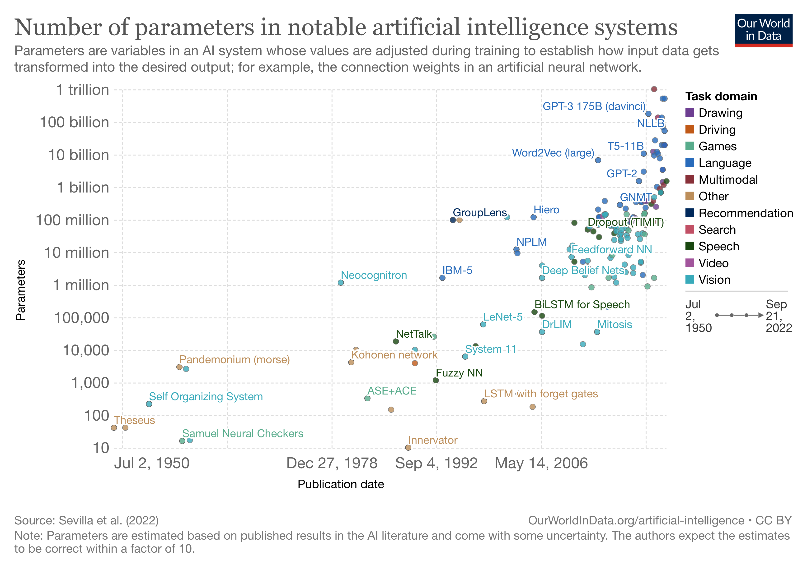

**Please do not write your name into this document.**

In the open-ended Exercises 2, 5, and 7, more extensive, carefully crafted, polished, insightful, and well motivated and explained answers will receive higher marks. Also see the assessment criteria on the course website <https://lse-my472.github.io/>

```{r}
# Load any libraries you use in the assignment here
suppressMessages(library(dplyr))
suppressMessages(library(ggplot2))
suppressMessages(library(tidyverse))
suppressMessages(library(ggrepel))
suppressMessages(library(httr))
suppressMessages(library(jsonlite))
suppressMessages(library(DBI))
suppressMessages(library(RSQLite))
suppressMessages(library(ggthemes))
suppressMessages(library(dplyr))
suppressMessages(library(scales))
suppressMessages(library(ggrepel))
suppressMessages(library(reshape2))
suppressMessages(library(gridExtra))
suppressMessages(library("rvest"))
suppressMessages(library("quanteda"))
suppressMessages(library("quanteda.textplots"))
suppressMessages(library(lubridate))
suppressMessages(library(ggalt))


# .rs.restartR()
```

### Exercise 1 (4 points)

Using the file `posts.csv` in the data folder of this repo (the sample of 10,000 public Facebook posts by members of the US congress from 2017), solve the following with `dplyr`:

-   Do not consider posts with zero likes
-   Compute the comment to like ratio (i.e. comments_count / likes_count) for each post and store it in a column `clr`
-   For each `screen_name`, compute a `normaliser_based_on_even_months = max(clr) - min(clr)`, i.e. the maximum minus the minimum `clr` value of posts by that `screen_name`, however, only taking into account **the posts made in even months, i.e. posts made in in February, April, June, August, October, December** when computing `max(clr) - min(clr)` for each `screen_name`
-   Set all `normaliser_based_on_even_months` that have a value of zero to NA or delete them
-   Afterwards create a column `normalised_clr` which stores the `clr` of all posts from the original data frame (other than those with zero likes which were deleted in the first step) divided by the `normaliser_based_on_even_months` of the associated screen name. The only exception are posts from screen names that had a `normaliser_based_on_even_months` value of zero and were deleted/set to NA before -- for these posts just set the value in `normalised_clr` to NA as well or drop the post from the final data frame. In other words, the value of a single post/line $i$ (written by a politician $p$) in that `normalised_clr` column can be computed as: $normalised\_clr_{i,p} = clr_{i} \; / \; normaliser\_based\_on\_even\_months_{p}$ for all observations for which there is a non-NA `normaliser_based_on_even_months` (no need to use a loop for this though, `dplyr` allows to compute it in a vectorised way)
-   Keep only those rows with `normalised_clr` \> 0
-   Arrange the data frame according to `normalised_clr` in ascending order
-   Print out only `screen_name` and `normalised_clr` for the first 10 rows, i.e. the posts with the 10 lowest `normalised_clr`

```{r}
posts_data <- read.csv("data/posts.csv")
posts_data <- posts_data %>%
  filter(likes_count>0)

# Compute the comment to like ratio 
posts_data$clr <- posts_data$comments_count / posts_data$likes_count 

# Extract the month from the date
posts_data$month <- as.numeric(substring(posts_data$date, 6, 7)) 

# Filter the odd months and group the data to get normaliser_based_on_even_months
table_normaliser_based_on_even_months <- posts_data %>% 
  filter(month%%2 == 0) %>%
  group_by(screen_name) %>%
  summarise(normaliser_based_on_even_months = max(clr)-min(clr))
  
table_normaliser_based_on_even_months <- table_normaliser_based_on_even_months %>%
  filter(normaliser_based_on_even_months>0)

# Merge the two table
posts_data <- merge(posts_data, table_normaliser_based_on_even_months, all=TRUE) 
posts_data$normalised_clr <- posts_data$clr / posts_data$normaliser_based_on_even_months

# Filter the data that normalised_clr = 0 and arrange the table
posts_data <- posts_data %>% 
  filter(normalised_clr > 0) %>%
  arrange(normalised_clr)

# Print the answer
head(posts_data[, c("screen_name", "normalised_clr")], 10) 
```

Hint: Any approach that yields the correct output here will receive full points, whether it uses multiple steps, merges, etc.

### Exercise 2 (15 points)

After the `dplyr` warm-up in the previous exercise, the next task will be to apply your knowledge of `dplyr` and other packages to an interesting real world-example with more extensive tabular data. Since 2021, there has been a much discussed rise in inflation in many economies. Often only a single number for inflation is computed and reported. It typically is the price change of an average basket of goods. "Basket" here just describes a set of goods with weights in which an average consumer approximately buys them. With the weights and prices of the individual goods, a price for the basket can be computed. The number for inflation is then the change of the basket's price over time.

There are many potential limitations of such an aggregate inflation figure. For example, businesses might be most interested in price changes only in their sectors. Furthermore, when prices of individual goods change in different ways, consumers will likely change the weights in which they buy goods. Hence, those aggregate inflation figures which keep the basket weights fixed for some time before reweighting, begin to deviate from the proportions in which people actually buy goods on average and become inaccurate. Also, while some goods see strong rises in prices, others do not. As a result, those consumers who buy goods in proportions far from the average consumer can face very different inflation figures. Taking all this into account, it can therefore be very interesting to analyse price changes of individual goods, smaller bundles of goods, etc. over time rather than only one aggregate number. Such findings can e.g. be helpful for researchers, businesses, consumers, or policy makers.

Since some years, the UK Office of National Statistics publishes detailed price data of goods which you can find [here](https://www.ons.gov.uk/economy/inflationandpriceindices/datasets/consumerpriceindicescpiandretailpricesindexrpiitemindicesandpricequotes). The website also contains extensive documentation. Download the csv file for "Price quotes, October 2022 edition of this dataset" (the correct file should be around 13MB), and the same for October 2021 and October 2020 (this e.g. allows to compute price changes from year to year, but you can also download additional/different months if helpful for your analysis). Explore the data, reshape and process it, and think of ways in which you can analyse and visualise it with packages such as `ggplot2` or `plotly`. You could e.g. look at prices of some goods vs. services, energy, how prices moved during different stages of the pandemic, etc. Thus, the answer can analyse prices changes for different goods and/or bundles of goods over time, report summary figures, and contain different visualisations. Also describe your analysis through written text via markdown. Did you find/learn anything interesting?

Note: As the downloaded data can quickly become too large for GitHub, you can store them outside your repository and load them from there along the lines of `read_csv(some/path/to/somefile.csv)`.

```{r}
# load data
df_2022 <- read_csv("~/downloads/final_assignment/upload-pricequotes202210.csv")
df_2021 <- read_csv("~/downloads/final_assignment/upload-pricequotes202110.csv")
df_2020 <- read_csv("~/downloads/final_assignment/upload-pricequotes202010.csv")


# Delete the items with a record of 0 (I think this is a false record) and calculate the average price of each item in each table
fl_2020 <- df_2020 %>% 
  select(ITEM_DESC,PRICE) %>%
  filter(PRICE != 0) %>%
  group_by(ITEM_DESC) %>%
  mutate(price_mean_2020 = mean(PRICE)) %>%
  select(-2) %>%
  unique()

fl_2021 <- df_2021 %>% 
  select(ITEM_DESC,PRICE) %>%
  filter(PRICE != 0) %>%
  group_by(ITEM_DESC) %>%
  mutate(price_mean_2021 = mean(PRICE)) %>%
  select(-2) %>%
  unique()

fl_2022 <- df_2022 %>% 
  select(ITEM_DESC,PRICE) %>%
  filter(PRICE != 0) %>%
  group_by(ITEM_DESC) %>%
  mutate(price_mean_2022 = mean(PRICE)) %>%
  select(-2) %>%
  unique()

# Draw a chart to see the price changes in 2020-2021 and 2020-2022, based on 2020
# Organization the plot
fl_all_price <- fl_2020 %>%
  left_join(fl_2021) %>%
  left_join(fl_2022) %>%
  mutate(difference_2020_2021 = price_mean_2021-price_mean_2020) %>%
  mutate(difference_2020_2022 = price_mean_2022-price_mean_2020) %>%
  na.omit() # https://blog.51cto.com/tao975/1391217?articleABtest=1 delete 'e'in the showing of number

# Change it into the plot we need to use
fl_all_price_longer <- pivot_longer(fl_all_price, cols = colnames(fl_all_price)[5:6], names_to = "Year", values_to = "Price_change") %>%
  select(ITEM_DESC, price_mean_2020, Price_change, Year)

# Check the table
head(fl_all_price_longer)

# Show it with ggplot
p1 <- ggplot(data = fl_all_price_longer, 
             mapping = aes(x = price_mean_2020, 
                           y = Price_change)) 

p1 + geom_point(aes(colour = Year)) +
  theme_minimal() +
  stat_smooth(method = "loess", 
              formula = 'y ~ x',
              size = 0.2) +
  ggtitle("Picture1: The relationship between price fluctuations and commodity prices",
          subtitle = "Based on average prices in 2020") +
  scale_y_continuous("Change of the price", 
                     labels = comma,
                     expand = c(0, 0)) +
  scale_x_log10("Price mean (log10) in 2020", 
                     labels = comma,
                     expand = c(0, 0)) +
  theme(axis.title.x = element_text(size = 11, 
                                    family = "Times",
                                    vjust = -1,
                                    face = "bold"),
        axis.title.y = element_text(size = 10, 
                                    family = "Times",
                                    face = "bold",
                                    vjust = 3),
        legend.position = "bottom",
        plot.title = element_text(hjust = 1,
                                  family = "Times",
                                  face = "bold",
                                  vjust = -1),
        plot.subtitle = element_text(size = 10,
                                     hjust = 1,
                                     vjust = -1))


# Answer1: Apart from a few special cases, we can see three points from the graph. First, it can be seen from the trend of the fitting curve that, in general, prices will show an upward trend in 2021 or 2022. Second, the upward trend is becoming more apparent as the original price of goods (i.e. the price in 2020) rises. Third, from the distribution of red and blue dots in the plot, it can be seen that compared with 2021, commodity prices in 2022 will be roughly flat, but the price changes will be larger when the price exceeds 100 yuan.


# Since the absolute value of each item is different, the percent of (item price change)/(original priceO of item in 2020 is assumed need to help supply the conclusion.
# Combine them into one graph,add coloums needed
fl_all_ratio <- fl_2020 %>%
  left_join(fl_2021) %>%
  left_join(fl_2022) %>%
  mutate(per_difference_2020_2021 = (price_mean_2021-price_mean_2020)/price_mean_2021*100) %>%
  mutate(per_difference_2021_2022 = (price_mean_2022-price_mean_2021)/price_mean_2021*100) %>%
  mutate(per_difference_2020_2022 = (price_mean_2022-price_mean_2020)/price_mean_2021*100) %>%
  na.omit() 

# Draw the chart to see the  changes of ratio in 2020-2021 and 2020-2022, based on 2020
# Organization the plot

fl_all_ratio_longer <- pivot_longer(fl_all_ratio, cols = colnames(fl_all_ratio)[5:6], names_to = "Year", values_to = "Price_change_percent") %>% 
  select(ITEM_DESC, price_mean_2020, Price_change_percent, Year)

# Check the table
head(fl_all_ratio_longer) 

# Show it in the plot too
p2 <- ggplot(data = fl_all_ratio_longer,
             mapping = aes(x = price_mean_2020, y = Price_change_percent )) 

p2 + geom_point(aes(colour = Year)) +
  theme_minimal() +
  stat_smooth(method = "loess", 
              formula = 'y ~ x',
              size = 0.2) +
  ggtitle("Picture2: The ration change between price fluctuations and commodity prices",
          subtitle = "Based on average prices in 2020") +
  scale_y_continuous("Change of the percent of the price", 
                     labels = comma,
                     expand = c(0, 0)) +
  scale_x_log10("Price mean (log10) in 2020", 
                     labels = comma,
                     expand = c(0, 0)) +
  theme(axis.title.x = element_text(size = 11, 
                                    family = "Times",
                                    vjust = -1,
                                    face = "bold"),
        axis.title.y = element_text(size = 10, 
                                    family = "Times",
                                    face = "bold",
                                    vjust = 3),
        legend.position = "bottom",
        plot.title = element_text(hjust = 1,
                                  family = "Times",
                                  face = "bold",
                                  vjust = -1),
        plot.subtitle = element_text(size = 10,
                                     hjust = 1,
                                     vjust = -1))

# Two supplementary conclusions can be drawn from the second chart. First, what is obviously different from the first table is that the proportion change of low-priced products is significantly higher than that of high-priced products. Although the absolute price does not change much, compared to its own unit price, it increases rapidly. Second, the second chart shows more clearly that, perhaps due to the impact of the epidemic, nearly 40% of the commodities in 2021 were reduced in price, but this proportion has been reduced by 2022, and more commodity prices are rising again. Third, there are a very few commodities rise and fall in magnitude compared to their original price is very exaggerated.

# What was the biggest drop and rise in percentage prices one year after the epidemic
arrange(fl_all_ratio,per_difference_2020_2021) %>%
  select(ITEM_DESC,per_difference_2020_2021) %>%
  head(10) 

arrange(fl_all_ratio,desc(per_difference_2020_2021)) %>%
  select(ITEM_DESC,per_difference_2020_2021) %>%
  head(10)

# What was the biggest drop and rise in percentage prices in the two year after the epidemic
arrange(fl_all_ratio,per_difference_2020_2022) %>%
  select(ITEM_DESC,per_difference_2020_2022) %>%
  head(10)

arrange(fl_all_ratio,desc(per_difference_2020_2022)) %>%
  select(ITEM_DESC,per_difference_2020_2022) %>%
  head(10)

# Finally we looked at these items

```

### Exercise 3 (10 points)

Use `ggplot2` to try to replicate the following [plot](https://ourworldindata.org/grapher/artificial-intelligence-parameter-count) on parameter numbers in AI systems from Our World in Data. Start with the basic features of the plot and then try to get as close to the original as possible with `ggplot2`. **There is no need to animate the plot, just use the latest static plot and replicate that.** As the data might change over time, feel free to download the image version from the website that you are going to replicate. Then you can add this image into the repo and afterwards bind it into this markdown e.g. with `` as a reference below your own plot.

Note: When you click on `DOWNLOAD` below the plot on the [website](https://ourworldindata.org/grapher/artificial-intelligence-parameter-count), you can download the latest image as well as all data.

```{r}
ai_data = read.csv("data/artificial-intelligence-parameter-count.csv")
ai_data$Parameters <- log10(ai_data$Parameters)
ai_data$Day <- as.Date(ai_data$Day)

# Define the color_dict which maps the domain to the color
color_dict = c("Drawing"="#633884","Driving"="#c0591e","Games"="#58ac8c","Language"="#356bbb","Multimodal"="#883039","Other"="#bc8e5a","Recommendation"="#122a5b","Search"="#c15065","Speech"="#1b470f","Video"="#a2559c","Vision"="#50abba") 

p3 <- ggplot(data = ai_data, 
             mapping = aes(x = Day, 
                           y = Parameters, 
                           color=Domain)) 
p3 + geom_point(size = 1) + 
  scale_colour_manual(values = color_dict) +
  scale_x_date(limits=c(as.Date("1950-07-02"), 
                        as.Date("2022-02-10")), 
               breaks=c(as.Date("1950-07-02"), 
                        as.Date("1965-04-19"), 
                        as.Date("1978-12-27"), 
                        as.Date("1992-09-04"), 
                        as.Date("2006-05-14"), 
                        as.Date("2020-01-21")),
               date_labels = '%b %e, %Y', 
               expand = c(0.05,0)) + # Set the X axis and tick
  scale_y_continuous(limits=c(1, 12), 
                     breaks=c(1, 2, 3, 4, 5, 6, 7, 8, 9, 10, 11, 12), 
                     labels=c("10", "100", "1,000", "10,000", "100,000", "1 million", "10 million", "100 million", "1 billion", "10 billion", "100 billion", "1 trillion"), 
                     expand = c(0.01,0)) + # Set the Y axis and tick
  labs(x="Publication date", 
       y="Parameters", 
       title="Number of parameters in notable artificial intelligence systems", subtitle ="Parameters are variables in an AI system whose values are adjusted during training to establish how input data gets \ntransformed into the desired output; for example, the connection weights in an artificial neural network.") + # Set the title and sub-title
  theme(plot.title=element_text(size=12), 
        plot.subtitle=element_text(size=8), 
        axis.title.x=element_text(size=8), 
        axis.title.y=element_text(size=8), 
        legend.text=element_text(size=8), 
        legend.title=element_text(size=8, 
                                  face = "bold")) + # Set the front size
  guides(colour=guide_legend(title="Task domain", 
                             override.aes=list(shape=15, size=2))) + # Set the legend theme
  theme(legend.key.size = unit(0.4, 'cm'), 
        legend.spacing.y = unit(0.1, 'cm')) +
  theme(legend.key = element_blank()) +
  theme(legend.margin = margin(t = 0,
                               unit ='cm')) +
  theme(legend.position = "right",
        legend.justification ="top") +
  theme(panel.background = element_rect(fill = 'white')) +
  theme(panel.grid.major.y = element_line(linetype = "21", 
                                          color ='gray', 
                                          size = 0.2), 
        panel.grid.minor.y = element_blank()) + # Set the panel grid theme
  theme(panel.grid.major.x = element_line(linetype="21",
                                        color='gray', 
                                        size=0.2), 
        panel.grid.minor.x = element_blank()) +
  theme(axis.ticks.y = element_blank(), 
        axis.ticks.x = element_blank()) +
  geom_text_repel(aes(label = Entity), 
                  size = 3)
  

```

Reference: 

### Exercise 4 (7 points)

When analysing textual data, the approaches we discussed such as counting tokens and building dictionaries, are already sufficient to answer many research questions. When the goal is to obtain an overview of information contained in unstructured textual data, however, some additional approaches such as ["named-entity linking"](https://en.wikipedia.org/wiki/Entity_linking) can be very helpful to know. Using a language model and a knowledge base, these tools can find words which describe people, institutions, places, etc., and importantly also obtain their ID in databases such as [Wikidata](https://www.wikidata.org/wiki/Wikidata:Main_Page). This allows to automatically extract an approximate list of e.g. institution who have a Wikidata entry and are mentioned in the text, which is very convenient for obtaining additional information via Wikidata/Wikipedia afterwards.

An open-source option is `OpenTapioca` which you can try in your browser via this [link](https://opentapioca.org/). It is e.g. implemented in Python as a plugin to the library [`spaCy`](https://spacy.io/api). The task of this exercise is to build an own simple function from scratch in R that allows to use OpenTapioca. A good first step is usually to check out the source code of the original (here Python) function which you can find [here](https://github.com/UB-Mannheim/spacyopentapioca/blob/main/spacyopentapioca/entity_linker.py). There is no need to know Python for this exercise, just looking at "url" and the function "make_request" in the code already indicates that it is actually just querying an API. Thus, using `httr` it is possible to build a simple function also in R. I have started this function, your task is to complete it and then demonstrate that it works with the exemplary sentences added below.

The function should return a tibble as output named `top_wikidata_links` with one row being one entity that was found in the input text and four columns being "id" (the Wikidata id), "label" (the name), "description" (a short description returned by the API via "\$desc" -- note that for some entities this description can be null, in that case just set the description in the output tibble to NA), and "score" (higher generally indicates a better fit to the text). You can also add further columns to your returned tibble, but the first four need to be these. The tibble should have as many rows as entities that were found in the text and had a score larger than `minimum_score`, which is a cutoff that the user can choose (all other matches returned by the API call with lower scores should not be included in the tibble).

Note that this open-source API does not work perfectly and misses some entities in texts, but can already be very helpful when exploring textual data. With very long input texts, it could also be tried whether breaking them down into smaller parts (e.g. sentences or paragraphs) before inputting them into the API increases accuracy or not.

Hint: Note that in the first test below, the two detected entities will be "Karl Popper" and "LSE". "Karl Popper" only returns a single match, however the "LSE" part of the text will return also matches other than the London School of Economics and Political Science, e.g. the London Stock Exchange. For each entity that the API returns, the tibble returned by the function needs to include a row as long as its associated score is larger than the minimum score.

```{r}
get_wikidata_links <- function(input_text, minimum_score) {
  
  #
  # Function which takes a character vector of length 1 as input (i.e. all text
  # needs to be combined into a single character) as well as a minimum certainty
  # score, and returns a tibble with key information and links to Wikidata
  #
  # Input
  #  - input_text: Text input (character)
  #  - minimum_score: Minimum score that every returned entity needs to have
  #                   (numeric)
  #
  # Output
  #  - top_wikidata_links: Table with the first four columns being 'id', 'label',
  #               'description', 'score' (tibble)
  #
  

  base_url <- "https://opentapioca.org/api/annotate" # Hint: Just search for "url" in the Python function linked above
  
  headers=c("User-Agent"="Mozilla/5.0 (Macintosh; Intel Mac OS X 10_15_7) AppleWebKit/537.36 (KHTML, like Gecko) Chrome/108.0.0.0 Safari/537.36") # Use the fake headers to make a POST request

  r <- POST(base_url, add_headers(.headers=headers), body=list("query"=input_text)) # Make a POST request to get the data

  text <- content(r, "text",encoding = "UTF-8")
  json <- fromJSON(text) # Decode the text to the json file
  
  len = length(json[[2]]$tags)
  df = json[[2]]$tags[[1]]
  
  for (i in 2:len){
    df = bind_rows(df, json[[2]]$tags[[i]]) # Concat the different tag tables
  }
  
  df <- df[c("id", 'label', 'desc', 'score')] # Select the required column
  top_wikidata_links <- as_tibble(df)
  top_wikidata_links <- top_wikidata_links %>% # Filter the row with minimum_score
    filter(score > minimum_score)
  return(top_wikidata_links)
  
}
```

Next demonstrate that your function works by running the following two tests:

```{r}
# Test 1
text_example_1 <- "Karl Popper worked at the LSE."
get_wikidata_links(text_example_1, -0.5)
# 
# Hint: The output should be a tibble similar to the one outlined below
#
# | id | label | description | score |
# | "Q81244" | "Karl Popper" | "Austrian-British philosopher of science" | 2.4568285 |
# | "Q174570" | "London School of Economics and Political Science" | "university in Westminster, UK" | "1.4685043" |
# | "Q171240" | "London Stock Exchange" | "stock exchange in the City of London" | "-0.4124461" |

# Test 2
text_example_2 <- "Claude Shannon studied at the University of Michigan and at MIT."
get_wikidata_links(text_example_2, 0)
```

### Exercise 5 (25 points)

The New York Times (NYT) APIs offer a rare free opportunity to analyse news data since 1851 (the year of the first issue of the paper). The "Archive API" allows to download all article headlines and lead paragraphs/snippets for a given month (and through iteration potentially for a range of years). While this does not allow to obtain the full articles, it still allows to download a substantial amount of textual data and thereby do own text analysis.

The task of this exercise is to use the **Archive API** (not the Article Search API) to develop and present a coherent analysis of a topic of your choice. This could e.g. be the news coverage of a specific historical event somewhere in the last 130 years that you are interested in (in that case the downloaded archive data would be the month(s) of that event) or also a general topic over time. While the NYT Archive API is the primary source of the analysis, in a next step also use either Wikidata (e.g. accessible via these [options](https://www.wikidata.org/wiki/Wikidata:Data_access) such as an API or the Wikidata websites themselves), or alternatively scrape Wikipedia to obtain further information on topics relevant for the selected newspaper texts. You can get links between NYT texts and Wikipedia e.g. via the function developed on Exercise 4 (or some variation of that function) and/or just manually by reading the articles and deciding which information to look up on Wikidata/Wikipedia. Your answer can e.g. contain text analysis with `quanteda`, word clouds, visualisations with `ggplot2` or `plotly`, analysis of tabular data with `dplyr`, or use of further R packages. Also motivate and describe your analysis through markdown texts.

As the downloaded data can again quickly become too large for GitHub, you can store them outside your repository and load them from there.

Hint 1: You might find the code examples from week 5 helpful for this exercise. For the Archive API, the last section in the file `02-nytimes-api.Rmd` illustrates how you can transform its output into a data frame. Usually the main available text is contained in the headline, abstract, lead_paragraph, and/or snippet columns (depending on which month/year you download some of these can be empty or the same). Note that the headline information in the data frame is nested and can be accessed with `df$headline$main`.

Hint 2: Named entity linking with tools such as OpenTapioca gives identifiers for Wikidata such as e.g. "Q7099". Not every Wikidata page also has an associated Wikipedia page, but those that have do contain links to the Wikipedia page. You can e.g. see this on Emmy Noether's Wikidata page <https://www.wikidata.org/wiki/Q7099> which contains links to her Wikipedia page in many languages in case you prefer to scrape data from Wikipedia rather than using Wikidata.

```{r}
#scrapes all information from Wikipedia used to analyse
# Interested in some topics related to the founding of China, the historical date is October 1949
apikey <-"fs6cDO0nSHkzTXgHJELKOgjau4zNNcGU"
archive_url <- sprintf("https://api.nytimes.com/svc/archive/v1/%g/%g.json?api-key=%s", 1949, 10, apikey)
r_49oct <- GET(archive_url) # run the associated query
json_as_text <- content(r_49oct, "text")
json <- fromJSON(json_as_text)
df_49oct<- json$response$docs %>% 
  as_tibble()

# Clean all data
# Expand the headline table
df_49oct_headline <- df_49oct$headline$main %>% 
  as.data.frame() %>%
  mutate(row_number()) 
names(df_49oct_headline)[names(df_49oct_headline) =="."] <-"headline"
          
# Expand the keywords table
df_49oct_keywords <- list(df_49oct$headline$main) %>% 
  as.data.frame() %>%
  mutate(row_number())
names(df_49oct_keywords)[names(df_49oct_keywords) =="c..Hungary.s.Note.to.Yugoslavia....Veterans.to.Aid.Cashmore..."] <-"keywords"

# Extraction time column
df_49oct_time <- df_49oct$pub_date %>% 
  as.data.frame() %>%
  mutate(row_number())
names(df_49oct_time)[names(df_49oct_time) =="."] <-"Date"

# Merge the three
df_49oct_all_tp <- df_49oct_headline %>%
  left_join(df_49oct_time)
df_49oct_all <- df_49oct_all_tp %>%
  left_join(df_49oct_keywords)

# Change the form into date
df_49oct_all$Date <- gsub("T.*", "", df_49oct_all$Date) 

# Find news whether contain "China"or"china"
df_49oct_CN <- df_49oct_all %>% mutate(grepl('China|china', df_49oct_all$headline))
names(df_49oct_CN)[names(df_49oct_CN) =="grepl(\"China|china\", df_49oct_all$headline)"] <-"relate_china"


# Calculate for picture1 to show how many days are report about China
df_49oct_CN_1 <- df_49oct_CN %>%
  group_by(Date,relate_china) %>%
  mutate(total = sum(n())) %>%
  distinct(total)
  
p5_1 <- ggplot(data = df_49oct_CN_1, mapping = aes(x = relate_china ))
p5_1 + geom_bar(aes(fill = relate_china),
                    alpha = 0.8,
                    colour=NA,
                    size=2,
                    width = 0.8)+
  scale_x_discrete("Any reports about China") +
  scale_y_continuous(name = "Days") +
  ggtitle("Picture1: The New York Times reported on China-related topics",
          subtitle = "In October 1949") +
  theme(axis.title.x = element_text(size = 11, 
                                    family = "Times",
                                    face = "bold"),
        axis.title.y = element_text(size = 11, 
                                    family = "Times",
                                    face = "bold"),
        axis.text.y = element_text(size = 9,
                                   face = "bold",
                                   family = "Times"),
        legend.position = "bottom",
        plot.title = element_text(hjust = 1,
                                  family = "Times",
                                  face = "bold",
                                  vjust = -1),
        plot.subtitle = element_text(size = 10,
                                     hjust = 1,
                                     vjust = -1),
        legend.title = element_blank())

# Conclusion1:In October 1949, more than half of the dates in the New York Times had stories about China  

# Show how many reports on each days

df_49oct_CN_2 <- df_49oct_CN %>%
  group_by(Date,relate_china) %>%
  mutate(total = sum(n())) %>%
  distinct(total) %>%
  filter(relate_china == T)


p5_2 <- ggplot(data = df_49oct_CN_2, mapping = aes(x = Date, y = total))
p5_2 + geom_col(aes(fill = total)) +
  scale_x_discrete("Date of reports about China") +
  scale_y_continuous(name = "Counts") +
  ggtitle("Picture2: The New York Times reported on China-related topics",
          subtitle = "Date & Counts") +
  coord_flip()+
  theme(axis.title.x = element_text(size = 11, 
                                    family = "Times",
                                    face = "bold"),
        axis.title.y = element_text(size = 11, 
                                    family = "Times",
                                    face = "bold"),
        axis.text.y = element_text(size = 9,
                                   face = "bold",
                                   family = "Times"),
        legend.position = "bottom",
        plot.title = element_text(hjust = 1,
                                  family = "Times",
                                  face = "bold",
                                  vjust = -1),
        plot.subtitle = element_text(size = 10,
                                     hjust = 1,
                                     vjust = -1),
        legend.title = element_blank())

# Conclusin2：As can be seen from Figure 2, although there are relevant reports, the total number is not many, only 1-3.

# Extract abstract for these articles，see what the reports focused on through the word cloud
df_49oct_abstract <- df_49oct$abstract %>%
  as.data.frame() %>%
  mutate(row_number()) 
names(df_49oct_abstract)[names(df_49oct_abstract) =="."] <-"abstract"

df_49oct_CN_3 <- df_49oct_CN %>%
  filter(relate_china == T) %>%
  left_join(df_49oct_abstract)

dfm_CN <- df_49oct_CN_3$abstract %>%
  tokens(remove_punct = TRUE, remove_numbers = TRUE) %>%
  tokens_remove(stopwords("en")) %>%
  dfm()
textplot_wordcloud(dfm_CN,min.freq = 1,max_words=100)

# Conclusion 3 ：We can see that words such as "communist", "diplomatic"，"press" appeared very frequently

# Extract the title of the article related to these three words separately, and establish a link with Wikipedia through the function of the fourth question
# Extract the title of the article related to these two words

df_49oct_CN_4 <- df_49oct_CN_3 %>% 
  mutate(grepl("communist|diplomatic|press", df_49oct_CN_3$abstract)) %>%
  filter(grepl("communist|diplomatic|press", df_49oct_CN_3$abstract) == T) %>%
  select(headline) 

df_49oct_CN_4

# Find that there are three articles titled, respectively：“Red China Sets Relations As Price of News Activity”“THE PACIFIC COAST; Recognition of Communist China Is a Widely Debated Issue”“8 of Chinese Embassy Staff In Paris Declare for Reds; 8 of China's Paris Embassy Staff Declare for Communist Regime”
# Store them together, and analysis it use a function of 4

CN_text <- "Red China Sets Relations As Price of News Activity THE PACIFIC COAST Recognition of Communist China Is a Widely Debated Issue 8 of Chinese Embassy Staff In Paris Declare for Reds; 8 of China's Paris Embassy Staff Declare for Communist Regime"

Wiki_CN_text <- get_wikidata_links(CN_text, 0) %>% distinct(id,.keep_all = TRUE)
Wiki_CN_text_link <- Wiki_CN_text %>% mutate(link = paste("https://www.wikidata.org/wiki/",Wiki_CN_text$id))

head(Wiki_CN_text_link)


```

### Exercise 6 (9 points)

Create an SQLite database called `fb-posts.sqlite` and connect to it with the `DBI` package. Store the file `posts.csv` (without any editing in R) in the database as its only table `posts`. The table may only contain the original information from `posts.csv`, all computations in this exercise have to be done with SQL.

With **only a single** (which is the main challenge in this exercise) **SQL query** through `DBI`, replicate the output from Exercise 1 (i.e. also normalise by the max minus min based only on even months etc.). This means that the query should return the same 10 lowest `normalised_clr` column values with the associated screen names as in Exercise 1.

```{r}
# Create database
db <- dbConnect(RSQLite::SQLite(), "data/fb-posts.sqlite")

# Reading the csv file into R
posts_data <- read.csv("data/posts.csv",
	stringsAsFactors = FALSE)

# Adding the only table: post data
dbWriteTable(db, "posts", posts_data)

#dbRemoveTable(db, "posts", posts_data) # use to knit

# Query the normalised_clr
# Use a virtual table S to store the temporary column `normaliser_based_on_even_months`
# Then join the virtual table S and the table posts to get the final result
dbGetQuery(db, "SELECT posts.screen_name, (comments_count/CAST(likes_count AS FLOAT)) / S.normaliser_based_on_even_months as normalised_clr
           FROM posts 
           JOIN (SELECT MAX(comments_count/CAST(likes_count AS FLOAT)) - MIN(comments_count/CAST(likes_count AS FLOAT)) as normaliser_based_on_even_months, screen_name 
           FROM posts
           WHERE CAST(SUBSTR(date,7, 1) AS INTEGER) % 2 = 0
           GROUP BY posts.screen_name
           ) as S on posts.screen_name = S.screen_name
           WHERE normalised_clr > 0
           ORDER BY normalised_clr ASC
           LIMIT 10")
```

### Exercise 7 (25 points)

The goal of this last exercise is to develop an own project, now also based on data of your choice rather than a pre-selected data source. It thereby involves to read into new APIs and to build a relational database on the way before analysing the collected data. To help with the task, the exercise breaks it down into steps. You will first obtain data **through APIs**, organise and store it in a relational database, and then examine and present the topic through computations and visualisations.

1.  Read through this [list](https://github.com/public-apis/public-apis) of APIs mentioned in the lecture and choose any of the API(s) in which you are particularly interested. Make sure that the API(s) you choose contain data for a coherent analysis later on. Also read the documentation of the API(s).

2.  Obtain the relevant data from your chosen API(s) **through R** with `httr` (in case you cannot get the code to run for your chosen API with `httr`, you can also use pre-built packages to proceed with the remaining parts). Then process the data in R e.g. with the typical `tidyverse` functionalities.

3.  Create a `SQLite` database, and store at least two tables into a well structured and thought-out relational database (no need to store any data in the database that you do not need in your later analysis). Run SQL queries which return the first five rows and all columns of your tables (to give the reader a preview of what you have collected). Also run SQL queries to return the total amount of rows of your tables.

4.  Demonstrate which of the tables can be joined. Return **only** the first five rows of the joined tables, and also return the total number of rows in the joined tables with a query.

5.  Now query the database with SQL to obtain data for the main analysis of this exercise. Afterwards you can do all subsequent steps with R. Analyse and illustrate your data e.g. numerically with packages such as `dplyr`, through visualisations based on `ggplot2` or `plotly`, quantitative text analysis with `quanteda`, or any other packages that are helpful. Also motivate and describe your analysis through markdown texts.

6.  

```{r}

# We first obtain the Carbon Intensity data from nationalgrid (https://carbon-intensity.github.io/)

# Build two functions to look up the carbon intensity and generation mix on specific date for the past 24 hours
get_carbon_intensity_by_day <- function(date){
  date_str <- as.character(date, "%Y-%m-%dT00:00Z")
  r <- GET(paste("https://api.carbonintensity.org.uk/intensity/",date_str,"/pt24h", sep=""))
  text <- content(r, "text",encoding = "UTF-8")
  json <- fromJSON(text, flatten = TRUE) # Decode the text to the json file
  return(json[[1]])
}

get_generation_mix_by_day <- function(date){
  date_str <- as.character(date, "%Y-%m-%dT00:00Z")
  r <- GET(paste("https://api.carbonintensity.org.uk/generation/",date_str,"/pt24h", sep=""))
  text <- content(r, "text",encoding = "UTF-8")
  json <- fromJSON(text, flatten = TRUE) # Decode the text to the json file
  return(unnest(json[[1]], generationmix))
}

# Consume too much time, annotate code to avoid duplicate crawling of large amounts of data
# carbon_intensity_df <- get_carbon_intensity_by_day(lubridate::make_date(2021, 1, 2) +
#                                                            lubridate::ddays(0))
# generation_mix_df <- get_generation_mix_by_day(lubridate::make_date(2021, 1, 2) +
#                                                            lubridate::ddays(0))

# Obtain the carbon intensity and generation mix data by day over a year
# Here we only select even day to reduce the data size
# !-------- Consume too much time, annotate code to avoid duplicate crawling of large amounts of data --------!
# for (i in 1:365) {
#   print(i)
#   try({
#   carbon_intensity_day_data <- get_carbon_intensity_by_day(lubridate::make_date(2021, 1, 2) +
#                                                            lubridate::ddays(i))
#   carbon_intensity_df <- bind_rows(carbon_intensity_df, carbon_intensity_day_data)
#   generation_mix_day_data <- get_generation_mix_by_day(lubridate::make_date(2021, 1, 2) +
#                                                            lubridate::ddays(i))
#   generation_mix_df <- bind_rows(generation_mix_df, generation_mix_day_data)
#   })
# }

# Clean the data
# carbon_intensity_df <- carbon_intensity_df %>%
#   filter(substring(carbon_intensity_df$to, 15, 17) == '00Z') %>%
#   filter(substring(carbon_intensity_df$to, 1, 4) == '2021')
# generation_mix_df <- generation_mix_df %>%
#   filter(substring(generation_mix_df$to, 15, 17) == '00Z') %>%
#   filter(substring(generation_mix_df$to, 1, 4) == '2021')
# 
# generation_mix_df$month <- as.numeric(substring(generation_mix_df$to, 6, 7)) 
# carbon_intensity_df$month <- as.numeric(substring(carbon_intensity_df$to, 6, 7))
# 
# generation_mix_df$hour <- as.numeric(substring(generation_mix_df$to, 12, 13))
# carbon_intensity_df$hour <- as.numeric(substring(carbon_intensity_df$to, 12, 13))
# 
# generation_mix_df$date <- substring(generation_mix_df$to, 1, 10)
# carbon_intensity_df$date <- substring(carbon_intensity_df$to, 1, 10)
# 
# carbon_intensity_df <- carbon_intensity_df[, c('date', 'month', 'hour',  'intensity')]
# generation_mix_df <- generation_mix_df[, c('date', 'month', 'hour', 'fuel',  'perc' )]

# Obtain the historic weather in London over the past year from oikolab(https://www.oikolab.com/)
# !-------- We annotate code to avoid duplicate crawling of large amounts of data --------!
# weather_data <- GET('https://api.oikolab.com/weather', query=toJSON(list(param=list('temperature','wind_speed'), start='2021-01-01', end='2021-12-31', freq="D", location='london', 'api-key'='6ad1c1803ff2471f92483f5ef6a7534f')))
# weather_text <- content(weather_data, "text",encoding = "UTF-8")
# weather_data <- fromJSON(weather_text, flatten = TRUE)[[0]]
# weather_data$month <- as.numeric(substring(weather_data$date, 6, 7)) 
```

2.  

```{r}
# Create database
db <- dbConnect(RSQLite::SQLite(), "data/uk_environment.sqlite")

# Adding the tables
# !-------- We annotate code to avoid adding the tables into the databse --------!
# dbWriteTable(db, "weather", weather_data)
# dbWriteTable(db, "carbon_intensity", carbon_intensity_df)
# dbWriteTable(db, "generation_mix", generation_mix_df)

# The table weather stores temperature and wind_speed of each day of 2021 in London
dbGetQuery(db, "SELECT * from weather LIMIT 5")
dbGetQuery(db, "SELECT COUNT(*) from weather")

# The table carbon_intensity stores carbon intensity data of each hour of 2021 in London. The carbon intensity  includes CO2 emissions related to electricity generation only.
dbGetQuery(db, "SELECT * from carbon_intensity LIMIT 5")
dbGetQuery(db, "SELECT COUNT(*) from carbon_intensity")

# The table generation_mix stores generation mix data of each hour of 2021 in London. Generation Mix for the GB power system. Contains the following fuel types: gas, coal, nuclear, biomass, hydro, imports, solar, wind, other.
dbGetQuery(db, "SELECT * from generation_mix LIMIT 5")
dbGetQuery(db, "SELECT COUNT(*) from generation_mix")
```

3.  

```{r}
# Join the table weather and carbon_intensity
dbGetQuery(db, "SELECT carbon_intensity.date,  carbon_intensity.hour, carbon_intensity.intensity AS carbon_intensity, weather.temperature, weather.wind_speed from weather
           JOIN carbon_intensity
           ON carbon_intensity.date = weather.date
           LIMIT 5")

dbGetQuery(db, "SELECT COUNT(*)  from weather
           JOIN carbon_intensity
           ON carbon_intensity.date = weather.date
           LIMIT 5")

# Join the table weather and generation_mix
dbGetQuery(db, "SELECT generation_mix.date,  generation_mix.hour, generation_mix.fuel, generation_mix.perc, weather.temperature, weather.wind_speed from weather
           JOIN generation_mix
           ON generation_mix.date = weather.date
           LIMIT 5")

dbGetQuery(db, "SELECT COUNT(*) from weather
           JOIN generation_mix
           ON generation_mix.date = weather.date
           LIMIT 5")

# Join the table carbon_intensity and generation_mix
dbGetQuery(db, "SELECT generation_mix.date,  generation_mix.hour, generation_mix.fuel, generation_mix.perc, carbon_intensity.intensity AS carbon_intensity from carbon_intensity
           JOIN generation_mix
           ON generation_mix.date = carbon_intensity.date
           LIMIT 5")

dbGetQuery(db, "SELECT COUNT(*) from carbon_intensity
           JOIN generation_mix
           ON generation_mix.date = carbon_intensity.date
           LIMIT 5")

# Join the table carbon_intensity and generation_mix and weather
dbGetQuery(db, "SELECT generation_mix.date,  generation_mix.hour, generation_mix.fuel, generation_mix.perc, carbon_intensity.intensity AS carbon_intensity, weather.temperature, weather.wind_speed from carbon_intensity
           JOIN generation_mix
           ON generation_mix.date = carbon_intensity.date
           JOIN weather
           ON generation_mix.date = weather.date
           LIMIT 5")
dbGetQuery(db, "SELECT COUNT(*) from carbon_intensity
           JOIN generation_mix
           ON generation_mix.date = carbon_intensity.date
           JOIN weather
           ON generation_mix.date = weather.date
           LIMIT 5")
```

4.  

```{r}
weather_carbon_intensity_df <- dbGetQuery(db, "SELECT carbon_intensity.date,  carbon_intensity.hour, AVG(carbon_intensity.intensity)/20 AS carbon_intensity, weather.temperature, weather.wind_speed from weather
           JOIN carbon_intensity
           ON carbon_intensity.date = weather.date
           GROUP BY carbon_intensity.date")
weather_carbon_intensity_df$date <- as.Date(weather_carbon_intensity_df$date)
p7_4 <-ggplot(data = weather_carbon_intensity_df, 
              mapping = aes(x=date)) 
p7_4 + geom_line(aes(y = temperature, 
                     colour = 'temperature', 
                     group = 1)) + 
  geom_line(aes(y = wind_speed, 
                colour = 'wind_speed', 
                group = 1)) + 
  geom_line(aes(y = carbon_intensity, 
                colour = 'carbon_intensity', 
                group = 1)) +
  theme(panel.grid.major.y = element_line(linetype = "21", 
                                          color = 'gray', 
                                          size = 0.2), 
        panel.grid.minor.y = element_blank()) + # Set the panel grid theme
  theme(panel.grid.major.x = element_line(linetype = "21", 
                                          color = 'gray', 
                                          size = 0.2), 
        panel.grid.minor.x=element_blank()) +
  scale_x_date(limits=c(as.Date("2021-01-01"), 
                        as.Date("2021-12-31")), 
               breaks=c(as.Date("2021-01-01"), 
                        as.Date("2021-03-01"), 
                        as.Date("2021-05-01"), 
                        as.Date("2021-07-01"), 
                        as.Date("2021-09-01"), 
                        as.Date("2021-11-01"), 
                        as.Date("2021-12-31")),
               date_labels = '%b,%e', 
               expand = c(0.05,0)) + # Set the X axis and tick
  scale_y_continuous(limits=c(-5, 25), 
                     breaks=c(-4, -2, 0, 2, 4, 6, 8, 10, 12, 14, 16, 18, 20, 22), 
                     labels=c(-4, -2, 0, 2, 4, 6, 8, 10, 12, 14, 16, 18, 20, 22), 
                     expand = c(0.01,0)) + # Set the Y axis and tick
  labs(x="date", 
       y="", 
       title="A quick look at the trend of UK weather and carbon emissions over the year") + # Set the  title and sub-title
  guides(colour=guide_legend(title="Data type", 
                             override.aes=list(shape=15, size=2))) +
  theme(legend.position="right",
        legend.justification="top") +
  theme(title=element_text(size=10))
```

5.  

```{r}
# Join the table weather and carbon_intensity
weather_carbon_intensity_df <- dbGetQuery(db, "SELECT carbon_intensity.date,  carbon_intensity.hour, carbon_intensity.intensity AS carbon_intensity, weather.temperature, weather.wind_speed from weather
           JOIN carbon_intensity
           ON carbon_intensity.date = weather.date")
p7_5 <- ggplot(data=weather_carbon_intensity_df, 
       mapping = aes(x = temperature, 
                     y = carbon_intensity, 
                     color = temperature)) 
p7_5 + geom_point(size = 0.4) +
  scale_color_gradient(low ="blue", 
                       high ="red") +
  geom_smooth(method = "auto", 
              se = TRUE, 
              fullrange = FALSE, 
              level= 0.95) +
  guides(colour = guide_legend(title = "Temperature", 
                               override.aes = list(shape=15, 
                                                   size=2))) +
  theme(legend.position = "right",
        legend.justification = "top") +
  labs(title ="Visualization of the relationship between temperature and carbon emissions", 
       subtitle = "The temperature & carbon emissions") +
  theme(title = element_text(size=10), 
        plot.subtitle = element_text(size=9))

# Conclusion：We find that when the temperature is low or high, it leads to an increase in carbon emissions,presumably due to an increase in electricity consumption.

```

```{r}
# Join the table weather and carbon_intensity
wind_generation_weather_df <- dbGetQuery(db, "SELECT generation_mix.date,  generation_mix.hour, generation_mix.fuel, generation_mix.perc, weather.temperature, weather.wind_speed from weather
           JOIN generation_mix
           ON generation_mix.date = weather.date
           WHERE fuel='wind'
")
wind_generation_weather_df$date <- as.Date(wind_generation_weather_df$date)
p7_5_2 <- ggplot(data = wind_generation_weather_df, 
                 mapping = aes(x = wind_speed, 
                               y = perc, 
                               color = wind_speed)) 
p7_5_2 + geom_point(size=0.4) +
  scale_color_gradient2(midpoint = mean(wind_generation_weather_df$wind_speed), 
                        low = "white", 
                        mid = "blue",
                        high = 'red') +
  geom_smooth(method = "auto", 
              se = TRUE, 
              fullrange = FALSE,
              level = 0.95) +
  guides(colour=guide_legend(title = "Wind speed", 
                             override.aes = list(shape = 15, 
                                                 size = 2))) +
  theme(legend.position = "right",
        legend.justification = "top") +
  labs(y='Percentage', 
       title="Visualization of the relationship between temperature and carbon emissions", 
       subtitle = "The wind speed & the percentage of wind power") +
  theme(title = element_text(size=10), 
        plot.subtitle = element_text(size = 9))

# Conclusion: We find that when the wind speed becomes higher, the percentage of wind power generation will increase significantly.
```

```{r}
# Join the table carbon_intensity and generation_mix
generation_mix_df <- dbGetQuery(db, "SELECT generation_mix.date,  generation_mix.hour, generation_mix.fuel, generation_mix.perc as prec, carbon_intensity.intensity AS carbon_intensity from generation_mix
           JOIN carbon_intensity
           ON generation_mix.date = carbon_intensity.date
           GROUP BY generation_mix.month, generation_mix.fuel")
generation_mix_df$date <- substr(generation_mix_df$date,6,10)
p7_5_3 <- ggplot(generation_mix_df) 
p7_5_3 + geom_col(aes( x = date,
                       y = prec,
                       fill = factor(fuel, 
                                     levels = c("coal","gas","biomass","hydro","imports","nuclear","other","solar","wind" ))),
                  position = 'stack',
                  width = 0.6) +
  geom_line(aes(x = date, 
                y = carbon_intensity*100/max(carbon_intensity),
                group = 1),
            linetype = 'dashed') + 
  guides(fill = guide_legend(title = "Fuel type", 
                             override.aes = list(shape = 15, 
                                                 size = 2))) +
  theme(legend.position = "right",
        legend.justification = "top") +
  labs(y ='percentage', 
       title = "Visualization of the relationship between generation mix and carbon emissions", 
       subtitle = "Carbon emissions & clean energy rises") +
  theme(title = element_text(size = 10), 
        plot.subtitle = element_text(size = 9))

# Conclusion: We find that carbon emissions will decrease when the percentage of clean energy rises. (dashed line denoted the carbon emissions.
```
